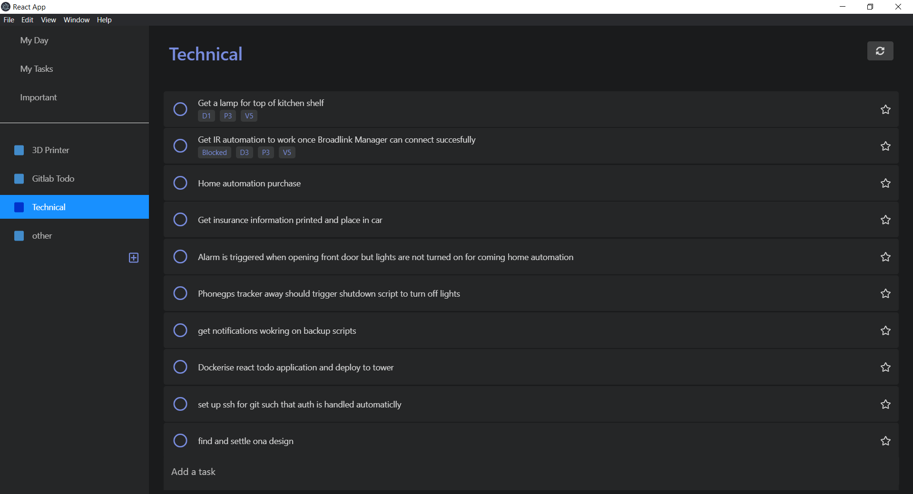
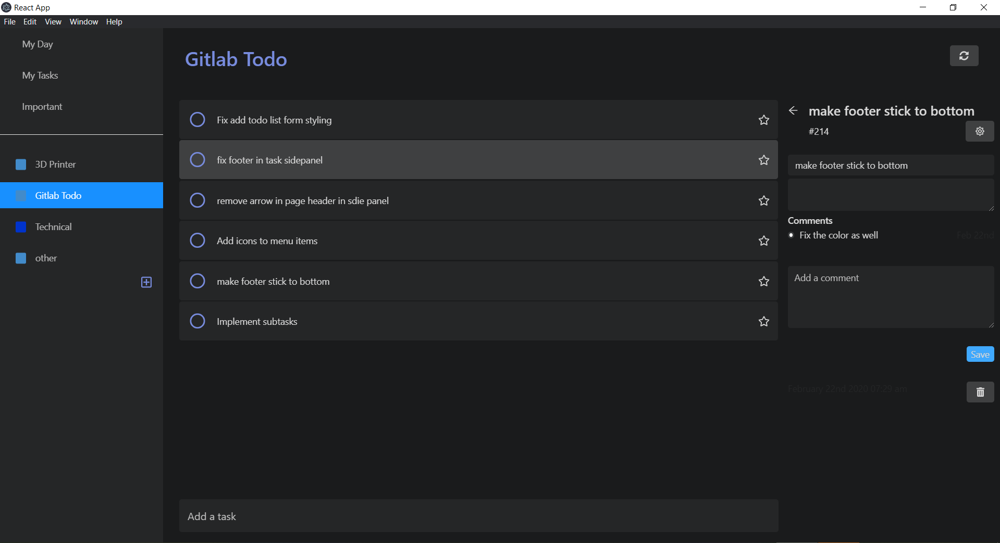

<div align="center">
  <a href="https://github.com/danobot/gitlab_task_manager">
    
  </a>
</div>

<h4 align="center">
  Elegant Microsoft To-Do inspired desktop and web app leveraging Gitlab's Issue Tracker in the backend
</h4>


Gitlab Task Manager is a task manager application which hooks into Gitlab's Issue Tracker as the backend. Simply create a project on `gitlab.com` or your personal Gitlab instance, generate an API token and you are ready to start using GTM.
## Features

* Uses Gitlab labels to manage task lists
* Add tasks to "My Day"
* Star tasks to mark them as important
* Clear all completed tasks
* Leave comments on tasks that appear as comments in Gitlab
* Create new task lists from the app
* Assign task labels using hashtags (e.g. "Get Milk #shopping" )
* View all issues with a particular label by clicking on the label itself

<div align="center">
  <a href="https://github.com/danobot/gitlab_task_manager">
    
  </a>
</div>

## Motivation
As I work on many hobby projects at the same time, I felt the need to add comments to a task as a place to note down decisions, research and root cause analysis findings. I really liked the look and feel of Microsoft Todo and the functionality of Gitlab's issue tracker and wanted to combine them into one easy-to-use tool.

## Implementation
This application was bootstrapped using Create React App and is distributed as a Docker web application as well as an Electron Desktop App.


## Getting Started
Copy `src/config.sample.js` to `src/config.js` and modify the Gitlab values.

```bash
yarn
yarn start
```

## Available Yarn/NPM Scripts

In the project directory, you can run:

* Run for development `yarn dev`
* Build the electron app `yarn dist`  (If this fails, run `npm install` first.)
* Build and publish Electron App `yarn dist`
* Run Electron build on Linux using Docker `bash dist.sh`
* Build docker image  `yarn docker-build`

## Docker Deployment
You can deploy the webapplication using docker for use on mobile. Rename `docker-compose.sample.yaml` to `docker-compose.yaml`.

```
docker-compose up -d
```
This will build the image and deploy.

## Development

`yarn start` Runs the app in the development mode. Open [http://localhost:3000](http://localhost:3000) to view it in the browser.

The page will reload if you make edits.<br />
You will also see any lint errors in the console.

## Contributing

See [contributing.md](contributing.md)
